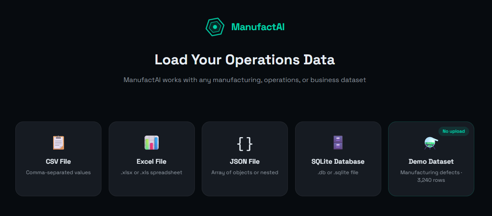
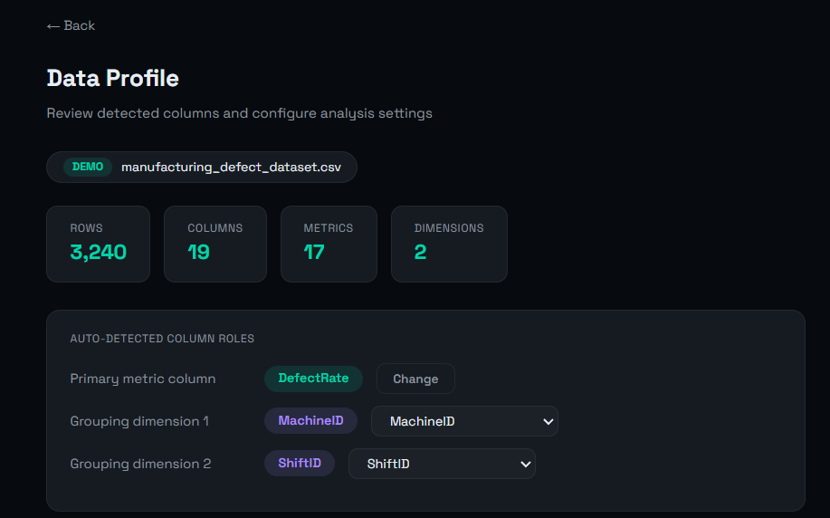
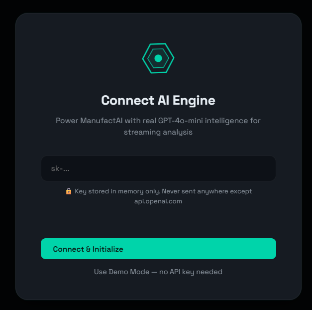
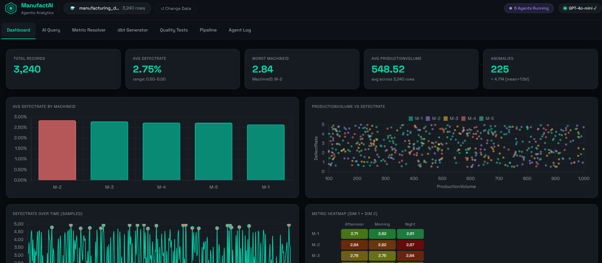
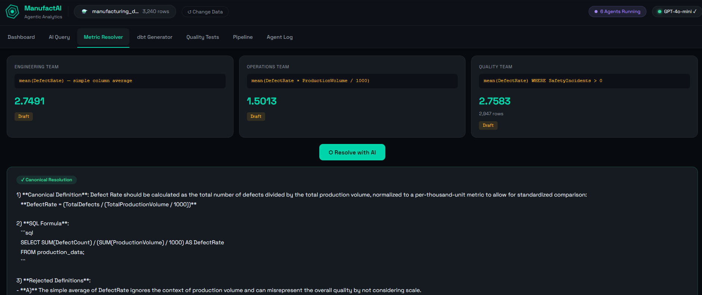
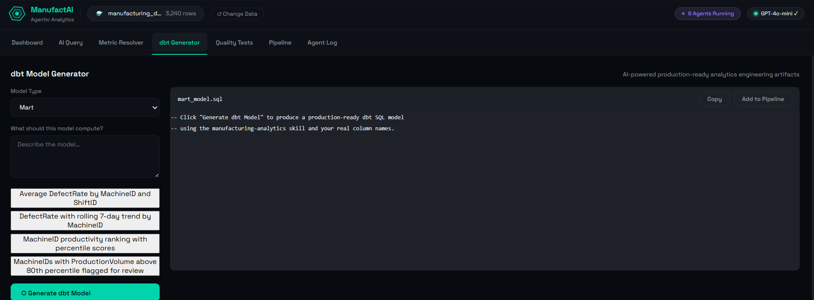
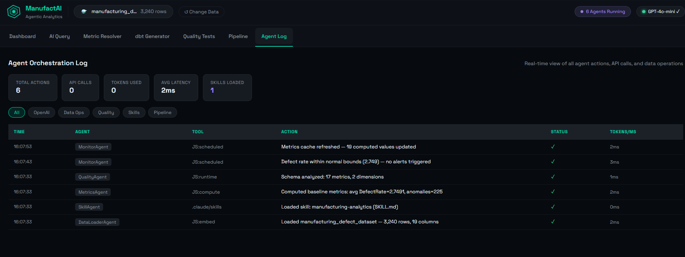

[](https://www.linkedin.com/in/pejman-ebrahimi-4a60151a7/)
[](https://huggingface.co/arad1367)
[](https://manufactai.vercel.app)
[](https://github.com/arad1367/manufactai)

---

<div align="center">

# ⬡ ManufactAI

### Agentic Metric Intelligence Platform

**The AI-powered command centre that ends metric chaos in manufacturing.**  
Upload any operations dataset → get instant KPI dashboards, AI-resolved metric conflicts,  
production-ready dbt models, data quality tests, and a live pipeline DAG — all in one app.

[](https://manufactai.vercel.app)
&nbsp;
[](https://manufactai.vercel.app)
&nbsp;
[](https://manufactai.vercel.app)
&nbsp;
[](https://manufactai.vercel.app)

</div>

---

## 🖼️ Screenshots

### Data Source Selector
Load any CSV, Excel, JSON, or SQLite file — or use the embedded 3,240-row manufacturing demo dataset with no upload required.



---

### Auto Data Profiling
ManufactAI auto-detects column roles: primary metric, grouping dimensions, and all numeric KPIs — no configuration needed.



---

### AI Engine Connection
Connect your OpenAI API key for live GPT-4o-mini streaming, or run fully offline in Demo Mode.



---

### KPI Dashboard
Live KPI tiles with count-up animation, bar chart (by machine), scatter plot (metric vs. secondary), time-series line with anomaly markers, and a Machine × Shift heatmap — all computed from your real data.



---

### Metric Conflict Resolver
Three teams define the same KPI differently. ManufactAI computes each formula against your live data, then streams a GPT-4o-mini canonical resolution with ISO 9001 / Six Sigma rationale.



---

### dbt Model Generator
Describe what you need in plain English → get a production-ready dbt SQL model + `schema.yml` with accepted_range tests, streamed token-by-token from GPT-4o-mini.



---

### Agent Orchestration Log
Every agent action, API call, token count, and latency — logged in real time with category filters and expandable detail rows.



---

## ✨ Features

| Tab | What it does |
|-----|-------------|
| **Dashboard** | KPI tiles, 4 Chart.js charts, Machine × Shift heatmap, AI insight card |
| **AI Query Agent** | Natural-language questions → streaming GPT-4o-mini answers + auto-generated chart |
| **Metric Conflict Resolver** | Shows competing KPI formulas computed from real data; AI picks the canonical definition |
| **dbt Generator** | Plain-English → production SQL + `schema.yml` with data quality tests |
| **Quality Tests** | Dynamic dbt-style test suite (not_null, accepted_range, anomaly rate) run against live data |
| **Pipeline Inspector** | Clickable SVG DAG: source → staging → intermediate → mart → exposure, with SQL per node |
| **Agent Log** | Real-time log of every agent, tool, token count, and latency |

---

## 🧠 How It Works

```
Your CSV / Excel / JSON / SQLite
         │
         ▼
  Auto Schema Analysis
  (primary metric, dimensions, ranges)
         │
         ▼
  7 AI Agents run in parallel:
  ┌──────────────────────────────────┐
  │  DataLoaderAgent   → ingest      │
  │  MetricsAgent      → compute     │
  │  QualityAgent      → validate    │
  │  QueryAgent        → answer NL Q │
  │  MetricAgent       → resolve KPI │
  │  dbtAgent          → generate SQL│
  │  PipelineAgent     → DAG inspect │
  └──────────────────────────────────┘
         │
         ▼
  All actions logged → Agent Log tab
```

---

## 🛠️ Tech Stack

| Layer | Technology |
|-------|-----------|
| Frontend | Vanilla HTML/CSS/JS — zero framework, single file |
| Charts | Chart.js v4.4 |
| Syntax Highlighting | highlight.js (atom-one-dark) |
| Data Parsing | SheetJS (Excel/CSV), native JSON, SQL.js (SQLite) |
| AI | OpenAI GPT-4o-mini via streaming API |
| Fonts | Space Grotesk (Google Fonts) |
| Deployment | Vercel (static, no backend) |
| Skills | Claude Code `.claude/skills/manufacturing-analytics/` |

---

## 🚀 Getting Started

### Option 1 — Live Demo (no install)
Visit **[https://manufactai.vercel.app](https://manufactai.vercel.app)**, click **Demo Dataset**, then **Use Demo Mode** — no API key needed.

### Option 2 — With your OpenAI key
1. Open [https://manufactai.vercel.app](https://manufactai.vercel.app)
2. Upload your own CSV/Excel/JSON file **or** choose Demo Dataset
3. Enter your `sk-...` OpenAI API key (stored in memory only, never sent anywhere except `api.openai.com`)
4. Explore all 7 tabs

### Option 3 — Run locally
```bash
git clone https://github.com/arad1367/manufactai.git
cd manufactai
# Open index.html directly in your browser — no build step needed
```

---

## 📁 Project Structure

```
manufactai/
├── index.html          # Entire app — 3,700 lines, 7 AI-powered tabs
├── data.js             # 3,240-row real manufacturing dataset (embedded)
├── CLAUDE.md           # Claude Code project context
├── .claude/
│   └── skills/
│       └── manufacturing-analytics/
│           └── SKILL.md    # dbt SQL generation skill
└── IMG/                # App screenshots
```

---

## 📊 Dataset

Real manufacturing dataset (`manufacturing_defect_dataset.csv`) with **3,240 rows × 19 columns**:

- **Primary metric:** `DefectRate` (0.50 – 4.99%)
- **Dimensions:** `MachineID` (M-1…M-5), `ShiftID` (Morning / Afternoon / Night)
- **Other metrics:** ProductionVolume, ProductionCost, QualityScore, DowntimePercentage, MaintenanceHours, WorkerProductivity, SafetyIncidents, EnergyConsumption, and more

Key computed stats: avg DefectRate = **2.75%** · anomaly threshold = **4.71%** · **225 anomalous rows**

---

## 👤 Author

**Pejman Ebrahimi** — Data Scientist · ML Engineer · AI Engineer · Instructor

[](https://www.linkedin.com/in/pejman-ebrahimi-4a60151a7/)
[](https://huggingface.co/arad1367)
[](https://github.com/arad1367)
[](https://giltech-unified-hub.lovable.app/)

---

<div align="center">
Built with Claude Code · Deployed on Vercel · Real manufacturing data
</div>
